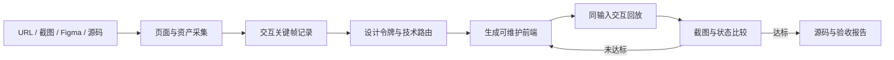

# Recreate Webpage Skill

一个面向交互级网页复刻的 Codex Skill。输入可以是公开 URL、截图、录屏、Figma 或现有源码；输出是可维护的前端项目、交互回放证据和同视口视觉差异报告。

仓库同时包含一个真实验证样例：根据 [jufcloud.com](https://www.jufcloud.com/) 当前公开页面重新实现的首屏横幅，覆盖导航、角色、标题、按钮、鼠标 3D 视差、角色浮动和目标站的固定宽度移动端表现。样例不复刻横幅以下的产品与页尾内容。


## Skill 能力

- 从 URL 采集 DOM、computed styles、字体、图片、SVG、视频和运行时特征
- 记录 hover、点击、鼠标移动、滚动、拖拽和动画关键状态
- 识别 CSS、Canvas、WebGL、Three.js、Lottie 和视频驱动效果
- 按参考机制选择 React/CSS、GSAP、Canvas 或 Three.js 实现
- 在相同视口和相同输入坐标下回放交互
- 输出截图差异、质量门禁结果和有意偏差
- 不以整页截图代替真实 UI

## 安装 Skill

仓库中的 Skill 位于 [`skills/recreate-webpage`](./skills/recreate-webpage)。本机开发时可以链接到 Codex Skill 目录：

```bash
mkdir -p ~/.codex/skills
ln -s "$(pwd)/skills/recreate-webpage" ~/.codex/skills/recreate-webpage
```

示例调用：

```text
使用 $recreate-webpage 复刻 https://example.com/，
以 1440x900 为桌面基准，并覆盖 390x844、鼠标视差、滚动动画和主要按钮状态。
```

## 工作流程



Skill 的硬性流程和验收门槛见 [`SKILL.md`](./skills/recreate-webpage/SKILL.md)。

## Jufcloud 验证样例

目标横幅实测不是 Canvas 或 WebGL，而是 CSS 3D 分层页面：

- 鼠标 X/Y 映射为首屏容器的 `rotateY/rotateX`
- 角色有独立 7 秒浮动动画
- 公开资源包含角色 PNG、标题 PNG、PCB 纹理和斜切 SVG
- 目标站移动端保持固定宽度，因此呈现局部裁切；样例按参考行为复现

同尺寸截图比较结果：

| 状态 | 相似度 |
| --- | ---: |
| 鼠标左侧视差 | 94.46% |
| 鼠标右侧视差 | 94.67% |
| 移动端固定宽度裁切 | 91.13% |

完整证据和差异说明见 [`evidence/fidelity-ledger.md`](./evidence/fidelity-ledger.md)。这些分数用于定位视觉差异，不等同于对功能、内容权利或生产可用性的评价。

## 运行样例

环境要求：Node.js 20+，npm 10+。

```bash
npm install
npm run dev
```

浏览器打开 `http://127.0.0.1:5173/`。

质量检查：

```bash
npm run lint
npm run build
```

图片比较脚本需要 Pillow：

```bash
python -m pip install pillow
python skills/recreate-webpage/scripts/compare_images.py \
  evidence/reference/jufcloud-mouse-left.png \
  evidence/rendered/jufcloud-mouse-left.png \
  --diff evidence/rendered/jufcloud-mouse-left-diff.png
```

## 目录

```text
skills/recreate-webpage/   # 可安装 Skill、脚本和参考规范
src/                       # Jufcloud React 复刻样例
public/assets/jufcloud/    # 验证样例引用的公开页面资产
evidence/reference/        # 参考页同视口证据
evidence/rendered/         # 本地实现截图和差异图
AGENTS.md                  # 项目工作和验收约束
```

## 合规与资产说明

本项目用于技术研究、授权复刻和视觉回归验证。不要使用 Skill 绕过登录、验证码、付费墙、反自动化或访问控制。

`public/assets/jufcloud` 中的品牌、角色和页面资产来源于目标公开网页，仅用于本次高保真验证样例；它们不因进入本仓库而自动获得开源再分发许可。公开发布、商用或二次分发前应确认权利归属，或替换为自有资产。
