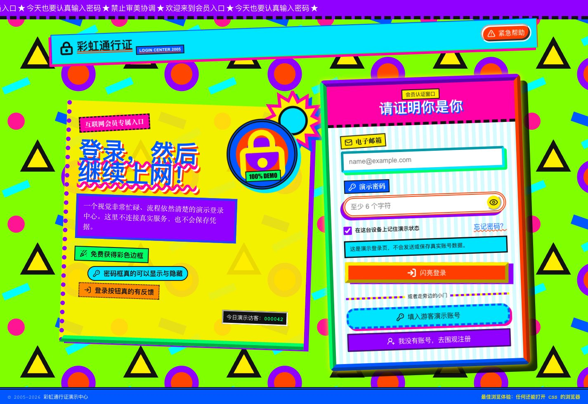
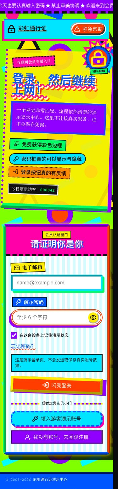
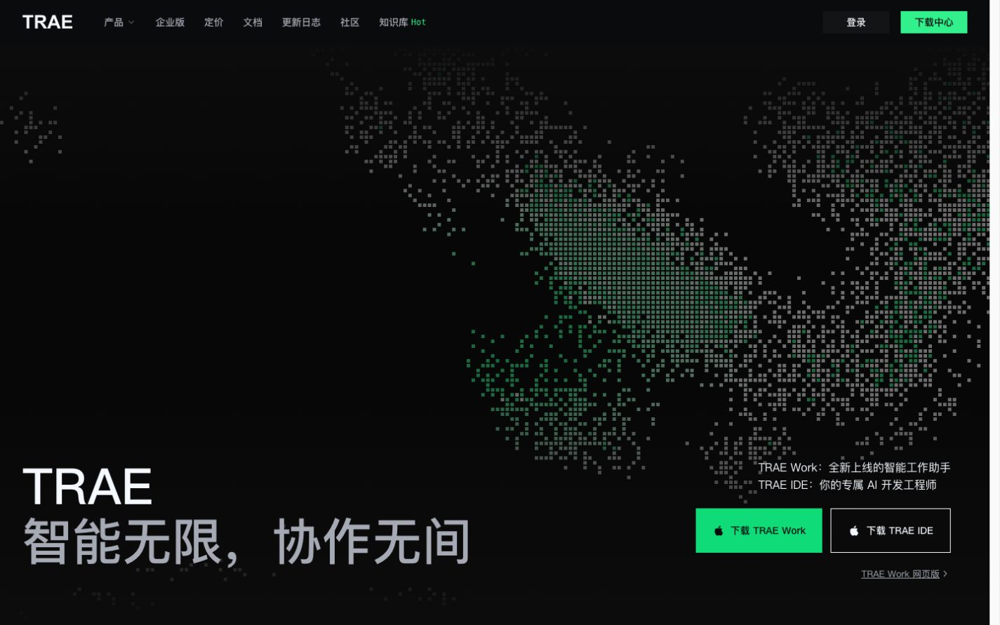
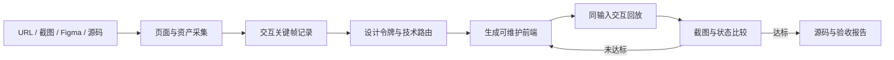

# HSY Skillbook

一个由 HSY 维护的 Codex Skill 合集。每个 Skill 都放在独立目录中，包含可安装的 `SKILL.md`、按需加载的参考资料，以及完成真实任务所需的脚本或资源。

## Skill 清单

| Skill | 用途 | 路径 |
| --- | --- | --- |
| `recreate-webpage` | 从公开 URL、截图、录屏、Figma 或现有源码生成可维护、可交互、可验证的前端实现 | [`skills/recreate-webpage`](./skills/recreate-webpage) |
| `redact-sensitive-content` | 对图片或网页截图中的指定区域、语义对象或非保留区域进行预览确认和安全打码 | [`skills/redact-sensitive-content`](./skills/redact-sensitive-content) |
| `uglify-webpage` | 从零生成或改造花花绿绿、故意不协调、审美极差但功能正常的网页 | [`skills/uglify-webpage`](./skills/uglify-webpage) |
| `design-language-learning-plan` | 诊断语言学习瓶颈，辨析学习方法证据，并制定可执行的英语或雅思训练方案 | [`skills/design-language-learning-plan`](./skills/design-language-learning-plan) |

## design-language-learning-plan

`design-language-learning-plan` 用能力维度诊断语言学习问题，区分有效机制、个人经验与未经证实的强数字，并通过“理解声音、情境绑定、撤掉辅助、直接理解、有约束输出与反馈”的闭环设计训练。它同时保留意义输入、意义输出、语言聚焦和流利度四条学习线，并提供雅思四科适配与阶段复盘指标。详细流程见 [`SKILL.md`](./skills/design-language-learning-plan/SKILL.md)。

安装到个人 Codex Skill 目录：

```bash
mkdir -p ~/.codex/skills
ln -s "$(pwd)/skills/design-language-learning-plan" ~/.codex/skills/design-language-learning-plan
```

## uglify-webpage

`uglify-webpage` 坚持“视觉上故意失败，工程上必须成功”：通过可复现的 seed、1～5 级丑陋强度和六种反设计预设，有控制地制造色彩、字体、组件、间距、装饰与动效冲突，同时保留用户要求的功能和安全底线。详细流程见 [`SKILL.md`](./skills/uglify-webpage/SKILL.md)。

### 丑登录页案例

使用默认 `rainbow-chaos` 预设、丑陋度 `4`、seed `8e43b9f572483b5d` 生成。案例保留邮箱校验、密码显隐、游客账号、加载和成功反馈，并通过桌面与移动端浏览器验收。完整记录见 [`evidence/ugly-login-ledger.md`](./evidence/ugly-login-ledger.md)。

#### 桌面端 · 1440×900



#### 移动端 · 390×844

<p align="center">
  
</p>

## redact-sensitive-content

`redact-sensitive-content` 使用“选择区域 → 编号预览 → 用户确认 → 正式打码 → 结果校验”的工作流，支持纯色遮挡、像素化、模糊和反向保留模式。详细流程见 [`SKILL.md`](./skills/redact-sensitive-content/SKILL.md)。

## recreate-webpage

`recreate-webpage` 面向交互级网页复刻，输出前端项目、交互回放证据和同视口视觉差异报告。

仓库包含三个真实验证样例：TRAE 首屏使用 Three.js 流体像素场，Jufcloud 首屏使用角色与多图层 CSS 3D 鼠标视差，Osty 使用 React/CSS 完整复刻创意作品集首页。




### 能力

- 从 URL 采集 DOM、computed styles、字体、图片、SVG、视频和运行时特征
- 记录 hover、点击、鼠标移动、滚动、拖拽和动画关键状态
- 识别 CSS、Canvas、WebGL、Three.js、Lottie 和视频驱动效果
- 按参考机制选择 React/CSS、GSAP、Canvas 或 Three.js 实现
- 在相同视口和相同输入坐标下回放交互
- 输出截图差异、质量门禁结果和有意偏差
- 不以整页截图代替真实 UI

### 安装

仓库中的 Skill 位于 [`skills/recreate-webpage`](./skills/recreate-webpage)。本机开发时可以链接到 Codex Skill 目录：

```bash
mkdir -p ~/.codex/skills
ln -s "$(pwd)/skills/recreate-webpage" ~/.codex/skills/recreate-webpage
```

示例调用：

```text
使用 $recreate-webpage 复刻 https://example.com/，
以 1440x900 为桌面基准，并覆盖 390x844、鼠标视差、滚动动画和主要按钮状态。
```

### 工作流程



Skill 的硬性流程和验收门槛见 [`SKILL.md`](./skills/recreate-webpage/SKILL.md)。

## TRAE 验证样例

目标横幅实测为 Three.js WebGL Shader 管线：

- 流体噪声 Shader 持续生成绿白场
- 5px 像素块、2px 间隙和亮度阈值形成点阵形态
- 鼠标在 0.3 归一化半径内交换绿白像素
- `1280px` 以上显示完整导航，移动端使用标题置顶和下载区置底布局

同尺寸截图比较结果：

| 状态 | 相似度 |
| --- | ---: |
| 桌面 1440x900 | 98.21% |
| 截图视口 1266x1288 | 97.24% |
| 移动端 390x844 | 95.43% |

完整证据和差异说明见 [`evidence/trae-fidelity-ledger.md`](./evidence/trae-fidelity-ledger.md)。这些分数用于定位视觉差异，不等同于对功能、内容权利或生产可用性的评价。

## Jufcloud 二次元 3D 样例

- 角色、阴影、标题、线路板、白色斜面和光效使用独立图层
- 鼠标 X/Y 映射为横幅的 `rotateY/rotateX`，并保留角色 7 秒浮动动画
- 在 `1440x900`、鼠标 `(1340, 180)` 状态下，独立路由截图相似度为 99.04%
- 完整参考和早期差异记录见 [`evidence/fidelity-ledger.md`](./evidence/fidelity-ledger.md)

## 运行样例

环境要求：Node.js 20+，npm 10+。

```bash
npm install
npm run dev
```

浏览器入口：

- TRAE：`http://127.0.0.1:5173/trae/`（根路径默认也是 TRAE）
- Jufcloud 二次元 3D：`http://127.0.0.1:5173/jufcloud/`
- Osty 创意作品集首页：`http://127.0.0.1:5173/osty/`

在线演示：

- TRAE：<http://38.76.205.234/trae/>
- Jufcloud 二次元 3D：<http://38.76.205.234/jufcloud/>

Demo 的“原网站”按钮会在新标签页打开对应参考站。服务器使用 [`deploy/nginx-recreate-demo.conf`](./deploy/nginx-recreate-demo.conf) 提供静态文件和 SPA 路由回退；Osty 本地视觉验收见 [`evidence/osty-fidelity-ledger.md`](./evidence/osty-fidelity-ledger.md)。

质量检查：

```bash
npm run lint
npm run build
```

图片比较脚本需要 Pillow：

```bash
python -m pip install pillow
python skills/recreate-webpage/scripts/compare_images.py \
  evidence/reference/trae-1440x900.png \
  evidence/rendered/trae-1440x900.png \
  --diff evidence/rendered/trae-1440x900-diff.png
```

## 目录

```text
skills/recreate-webpage/          # 可安装 Skill、脚本和参考规范
skills/redact-sensitive-content/  # 图片与网页截图打码 Skill
skills/uglify-webpage/            # 故意反协调但功能正常的网页 Skill
skills/design-language-learning-plan/ # 语言学习诊断、证据边界与英语/雅思训练方案
src/                              # TRAE、Jufcloud 与 Osty React 样例
public/assets/jufcloud/           # Jufcloud 验证样例公开页面资产
public/assets/osty/               # Osty 首页公开图片与字体资源
evidence/reference/               # 参考页同视口证据
evidence/rendered/                # 本地实现截图和差异图
deploy/                           # 不含凭据的 Nginx 部署配置
AGENTS.md                         # 项目工作和验收约束
```

## 合规与资产说明

本项目用于技术研究、授权复刻和视觉回归验证。不要使用 Skill 绕过登录、验证码、付费墙、反自动化或访问控制。

TRAE 样例的动态背景由本项目重新实现，不包含目标站的模型、视频或截图资产。页面名称、Logo 文字和可见产品文案仍属于其各自权利人；公开发布、商用或二次分发前应确认使用范围或替换为自有品牌内容。仓库中保留的早期 Jufcloud 验证资产同样不自动获得开源再分发许可。
